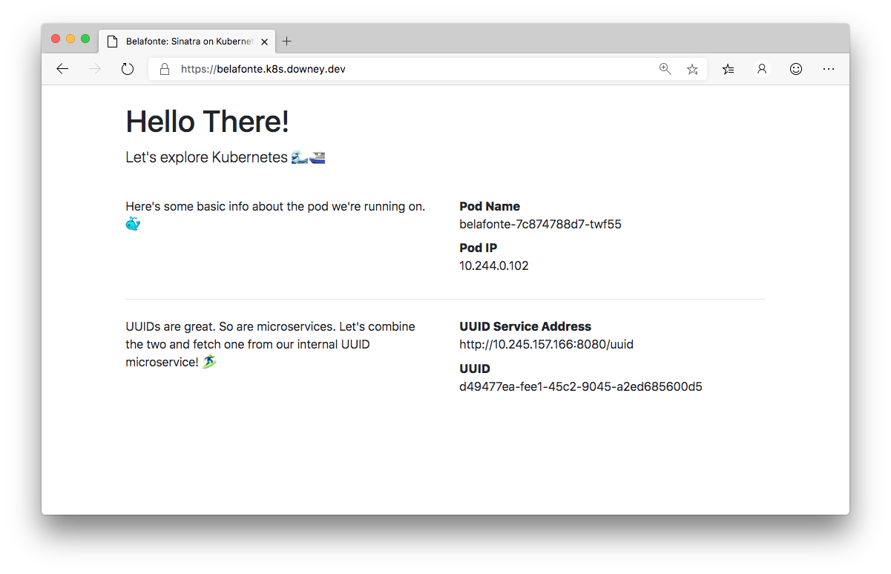

# sinatra-k8s-sample

[](https://cloud.docker.com/u/downey/repository/docker/downey/sinatra-k8s-sample)

A basic stateless Ruby app for experimenting with Kubernetes



---

This repo contains the sample code of a basic Sinatra app called [Belafonte](https://en.wikipedia.org/wiki/The_Life_Aquatic_with_Steve_Zissou) that can be deployed to Kubernetes for learning and exploration.

It was written to be an example application for my blog post on [Cloud Native Buildpacks and kapp in Kubernetes](https://dev.to/downey/simplify-kubernetes-app-deployments-with-cloud-native-buildpacks-and-kapp-339b).

The app prints out some basic information about the `pod` it is running on and demonstrates inter-pod communication by fetching a UUID from another microservice that spits out UUIDs ([httpbin](https://github.com/postmanlabs/httpbin)).

## Building the Image

I use the [Cloud Native Buildpacks](https://buildpacks.io/) [`pack`](https://github.com/buildpack/pack) CLI and heroku Ruby buildpack to build and publish the container image for this app.
```bash
pack build downey/sinatra-k8s-sample --builder heroku/buildpacks --buildpack heroku/ruby --publish
```

If you want to publish to your own image repository, replace the `downey/sinatra-k8s-sample` portion above.

## Deploying to Kubernetes

I have been deploying to a Digital Ocean hosted Kubernetes cluster that has the following installed:

* [kubernetes/ingress-nginx](https://github.com/kubernetes/ingress-nginxhttps://github.com/kubernetes/ingress-nginx) for workload Ingress
    * https://kubernetes.github.io/ingress-nginx/deploy/#gce-gke (followed the GKE steps for Digital Ocean)
* [cert-manager](https://github.com/jetstack/cert-manager) for automated provisioning of lets-encrypt TLS certs
    * https://docs.cert-manager.io/en/latest/getting-started/install/kubernetes.html
* A lets-encrypt `ClusterIssuer` for `cert-manager`
    ```yaml
    apiVersion: cert-manager.io/v1alpha2
    kind: ClusterIssuer
    metadata:
      name: letsencrypt-prod
      namespace: cert-manager
    spec:
      acme:
        email: email@example.com # change to your email address
        http01: {}
        privateKeySecretRef:
          name: letsencrypt-prod
        server: https://acme-v02.api.letsencrypt.org/directory
        solvers:
        - http01:
            ingress:
              class: nginx
    ```
    
To deploy the app itself I have been using the [`kapp`](https://get-kapp.io/) CLI.

```bash
kapp deploy -a belafonte -f deploy
```

This will deploy everything in the `deploy` directory and `kapp` will ensure resources are applied in a reasonable order (e.g. namespaces and CRDs first) and it will wait until the status checks succeed for resources before continuing.

After that finished you can run `kapp inspect -a belafonte` and you should see all of the resources that were deployed. Example:

```bash
Resources in app 'belafonte'

Namespace  Name                             Kind                Owner    Conds.  Rs  Ri  Age
(cluster)  belafonte                        Namespace           kapp     -       ok  -   33m
belafonte  belafonte                        Certificate         cluster  1/1 t   ok  -   33m
^          belafonte                        Deployment          kapp     2/2 t   ok  -   33m
^          belafonte                        Endpoints           cluster  -       ok  -   33m
^          belafonte                        Ingress             kapp     -       ok  -   33m
^          belafonte                        Service             kapp     -       ok  -   33m
^          belafonte-1918113368             CertificateRequest  cluster  1/1 t   ok  -   33m
^          belafonte-1918113368-3886681398  Order               cluster  -       ok  -   33m
^          belafonte-694ffdfdd4             ReplicaSet          cluster  -       ok  -   33m
^          belafonte-7c874788d7             ReplicaSet          cluster  -       ok  -   11s
^          belafonte-7c874788d7-lm6hj       Pod                 cluster  4/4 t   ok  -   11s
^          httpbin                          Deployment          kapp     2/2 t   ok  -   33m
^          httpbin                          Endpoints           cluster  -       ok  -   33m
^          httpbin                          Service             kapp     -       ok  -   33m
^          httpbin-85b9b4c565               ReplicaSet          cluster  -       ok  -   33m
^          httpbin-85b9b4c565-x2nmb         Pod                 cluster  4/4 t   ok  -   33m
```
